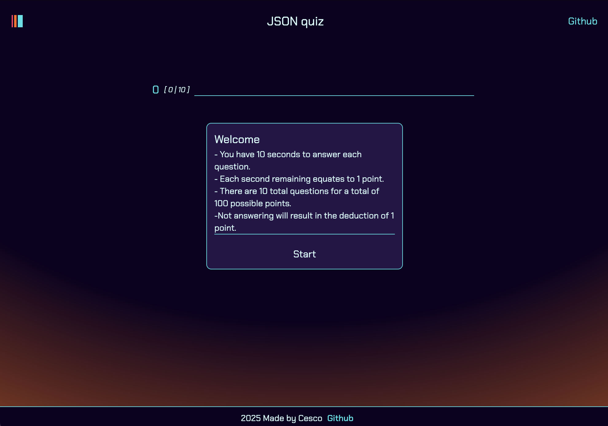
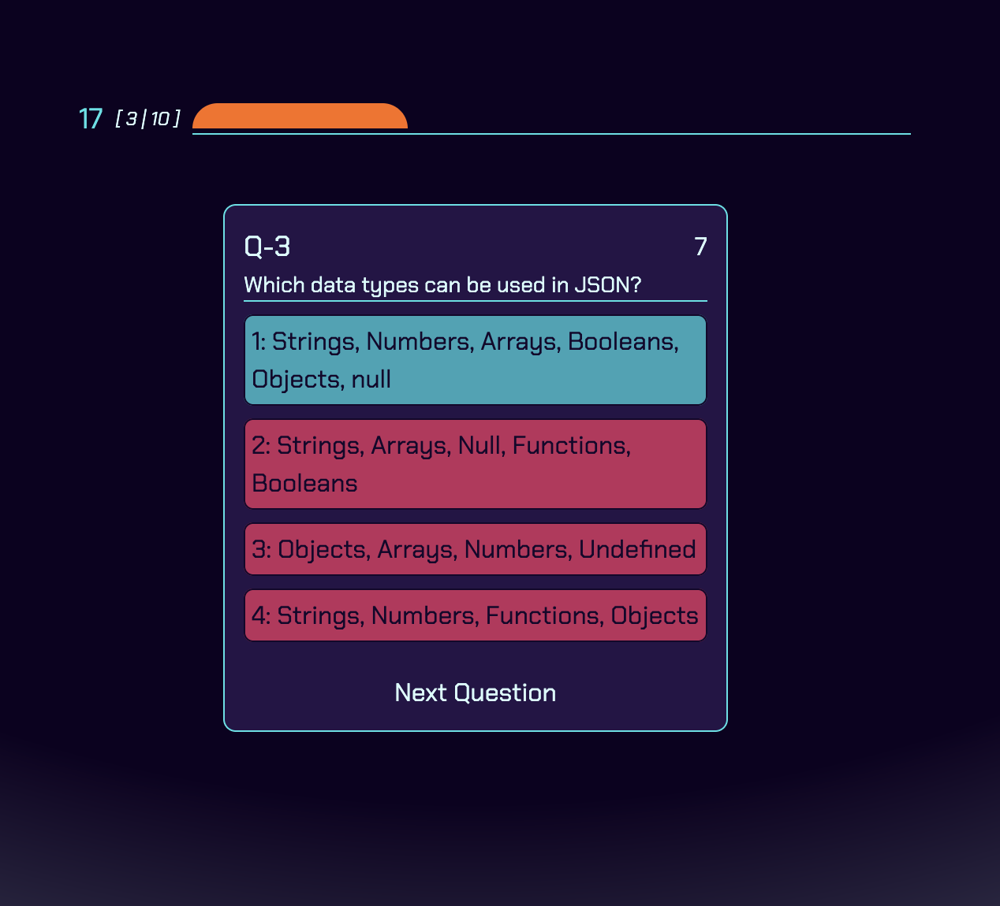
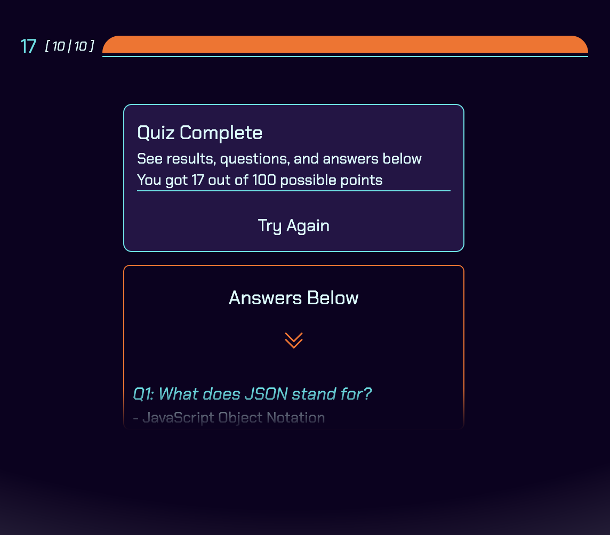
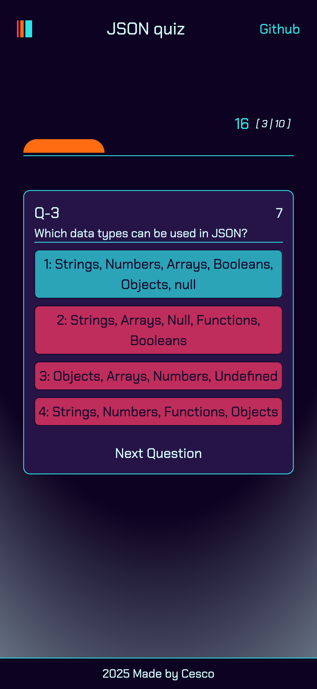

# JSON Quiz, browser based quiz made in React

JSON Quiz is a browser based quiz made in react based on the [project from roadmap.sh](https://roadmap.sh/projects/quiz-app). Questions can easily be customized to cover any
topic by importing your own json multiple choice questions in the format seen in this project.
<br>
<br>
Live Demo: coming soon!

## How it was made:

**Tech used:** 
- Framework: React
- Build Tool: Vite
- Styling: TailwindCSS, CSS
- State Management: Jotai
- Animation: Motion
- Other: 
  - HeroIcons for down chevron

## Visual Examples
<br> Desktop Landing Page <br>



<br> Desktop Question Example <br>



<br> Desktop Quiz End <br>



<br> Mobile View <br>



## How To Run The Project

1. Download or clone the repo onto your local environment, and navigate into the folder
```
git clone https://github.com/cescosgames/jsonquiz
cd jsonquiz
```
2. Install dependencies
```
npm install
```
3. Run the dev server
```
npm run dev
```
4. Go to your selected local host in your browser (Vite default is 5173)
5. If you want to import custom question, navigate to the src -> assets -> data and replace the content of questions.json with your preferred content. The format is like this:
```json
{
    "id": "your ID here",
    "text": "your question here",
    "answers": [
        {
        "text": "your 1st multiple choice answer here",
        "isCorrect": true
        },
        {
        "text": "your 2nd multiple choice answer here",
        "isCorrect": false
        },
        {
        "text": "your 3rd multiple choice answer here",
        "isCorrect": false
        },
        {
        "text": "your 4th multiple choice answer here",
        "isCorrect": false
        }
    ]
},

## Features:

Following the project guidelines, this project features...
1. An initial start page featuring a start button alongside some details about the quiz
2. Correct quiz flow with each multiple choice question progressing in order from first to last
3. Questions presented as individual cards with each answer presented as a button on the card
4. User feedback upon answering the question with the correct answer appearing teal, the incorrect red.
5. A correctly incrementing score if the user is correct
6. A final score at the end of the quiz featuring all the questions and correct responses
7. A timer on each question that 'skips' the current question and docks a point on timeout. 
8. Full keyboard navigation possible using just tab/shift-tab and space/enter 

## Lessons Learned:

Fun project, felt quicker than the last few which gave me time to have fun with animations and design. In the weather app, I didn't end up using Framer as recommended
so I decided to implement it here instead specifically on the 'glow' gradient background where we use Framer to animate between an array of our color palette. This reminded
me more of my game dev experience in how to structure the logic and flow.
<br><br>
I did actually struggle however with voice over and screen readers on this project. The nature of this project, being a quick quiz, made the implementation of voice over feel
somewhat impossible. If I had more time to work on this, I would definitely make an accessible version for screen readers that would feature increased timer length and clear
question voice over. Being able to combine that with the current keyboard navigation (which could be improved with auto-focus on question answer/skip) would greatly improve the
accessibility of this quiz. 
<br><br>
Overall though, I'm happy with how this project turned out. It works well in mobile and desktop and feels like it accomplishes the task at hand in a simple and understandable way.